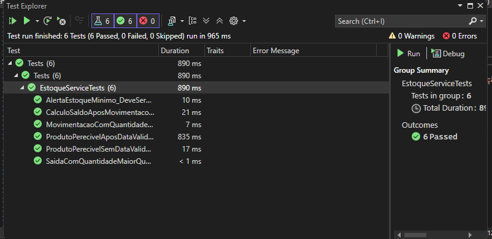

# Sistema de Gerenciamento de Estoque

Sistema para gerenciamento de estoque com controle de produtos, movimentações de entrada e saída, e validações de integridade.

## Regras de Negócio Implementadas

### Produtos
- Todo produto deve ter SKU, nome e preço unitário
- Produtos podem ser perecíveis ou não-perecíveis
- Produtos perecíveis devem ter data de validade
- Cada produto tem uma quantidade mínima de estoque configurável
- Sistema emite alertas quando o estoque está abaixo do mínimo

### Movimentações de Estoque
- Entradas de produtos perecíveis devem informar lote e data de validade
- Não é permitido registrar entrada de produtos vencidos
- Não é permitido registrar saída com quantidade maior que o estoque disponível
- Não é permitido registrar movimentações com quantidade negativa ou zero
- O sistema calcula automaticamente o saldo de estoque após cada movimentação

## Diagrama de Entidades

```
+----------------+       +------------------------+
|    Produto     |       | MovimentacaoEstoque    |
+----------------+       +------------------------+
| Id             |       | Id                     |
| SKU            |       | ProdutoId              |
| Nome           |<----->| Quantidade             |
| PrecoUnitario  |       | TipoMovimentacao       |
| Perecivel      |       | DataMovimentacao       |
| QuantidadeMin  |       | Lote                   |
|                |       | DataValidade           |
+----------------+       +------------------------+
```

## Exemplos de Requisições API

### Cadastrar Produto
```http
POST /api/produtos
Content-Type: application/json

{
  "sku": "PROD001",
  "nome": "Produto Teste",
  "precoUnitario": 10.50,
  "perecivel": false,
  "quantidadeMinima": 5
}
```

### Registrar Entrada no Estoque
```http
POST /api/movimentacoes/entrada
Content-Type: application/json

{
  "produtoId": 1,
  "quantidade": 10,
  "lote": "LOTE001",
  "dataValidade": "2025-12-31"
}
```

### Registrar Saída do Estoque
```http
POST /api/movimentacoes/saida
Content-Type: application/json

{
  "produtoId": 1,
  "quantidade": 5
}
```

### Consultar Estoque Atual
```http
GET /api/estoque
```

### Consultar Produtos Abaixo do Estoque Mínimo
```http
GET /api/estoque/abaixo-minimo
```

## Como Executar o Projeto

1. Pré-requisitos:
   - .NET 8.0 SDK
   - MySQL (ou outro banco de dados configurado no appsettings.json)

2. Clone o repositório:
   ```
   git clone https://github.com/seu-usuario/GerenciamentoEstoque.git
   cd GerenciamentoEstoque
   ```

3. Configure a conexão com o banco de dados no arquivo `appsettings.json`

4. Execute as migrações do banco de dados:
   ```
   dotnet ef database update
   ```

5. Execute o projeto:
   ```
   dotnet run --project GerenciamentoEstoque
   ```

6. Acesse a API em:
   ```
   https://localhost:5001/swagger
   ```

## Testes

Os testes unitários foram implementados para validar as regras de negócio e integridade do sistema. Você pode verificar o comprovante de execução dos testes na pasta [Tests/Comprovante](Tests/Comprovante).

Para executar os testes:
```
dotnet test
```

